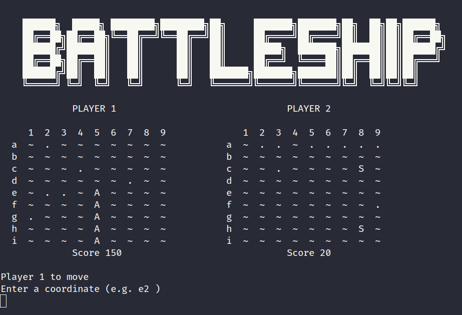
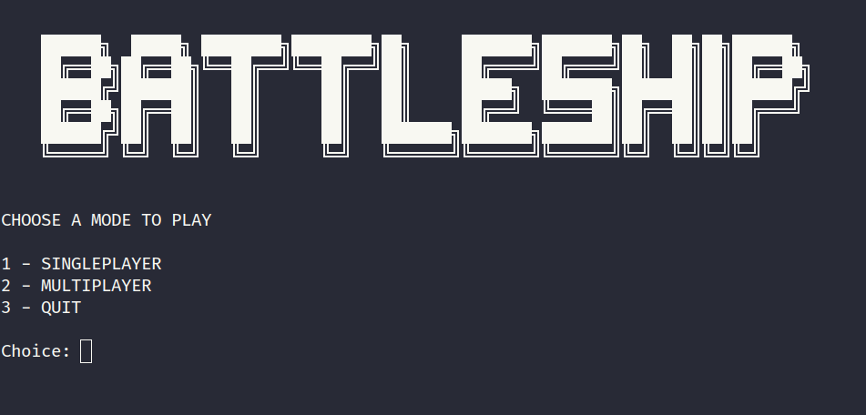
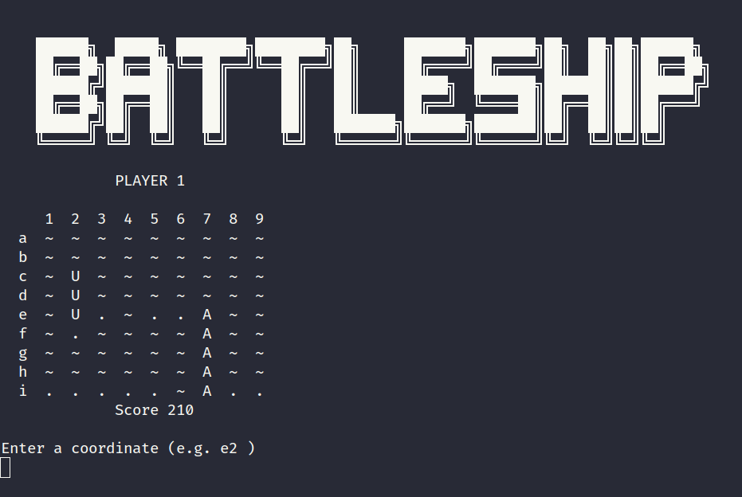

# Battleship

*Fig. 1: Multiplayer*


This is a battleship console game written in C++.


## Requirements
An unix-like environment probably will do the job, but the to make it clear, here's the dependecies that is be necessary to build the project.
- g++
- make

## Build & Run

Build
```bash
make build
```
Run

```bash
make run
```
Or just do all at once
```bash
make
```


*Fig. 2: Menu*



*Fig. 3: Singleplayer*
